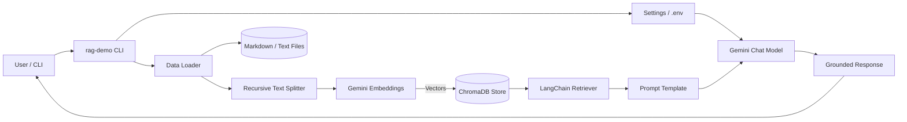

# Gemini RAG Example

Sample “hello world” Retrieval Augmented Generation (RAG) project that wires together
[LangChain](https://python.langchain.com/), [ChromaDB](https://www.trychroma.com/), and
[Google Gemini](https://ai.google.dev/gemini-api) to answer questions grounded in local files.

The goal is to give you a minimal-yet-complete starting point that fits in a single folder, is easy
to customize with your own markdown notes, and demonstrates the essential RAG flow:

1. Load and chunk documents.
2. Embed them with Gemini.
3. Persist vectors to Chroma.
4. Retrieve context and feed it back into Gemini for a grounded response.

## Prerequisites

- Python 3.10+
- A Google Gemini API key with access to `gemini-1.5-flash` (or another chat model) and
  `models/text-embedding-004`

## Quick Start

```bash
# 1) Create a virtual environment (recommended)
python -m venv .venv
source .venv/bin/activate

# 2) Install dependencies
pip install -e .

# 3) Configure credentials
cp .env.example .env
echo 'GEMINI_API_KEY="your-key"' >> .env  # or edit the file directly

# 4) Run the sample query
rag-demo -q "Give me a one-liner about this demo."
```

## Example Runs

Once dependencies and credentials are in place, try these variations:

```bash
# Use the default sample question
rag-demo

# Ask something custom
rag-demo --query "Summarize the architecture in two sentences."

# Temporarily target a different knowledge base folder
RAG_DATA_DIR=./my_notes rag-demo -q "What's the pitch?"
```

If you prefer not to install the console script, you can run the module directly:

```bash
python -m rag_demo.cli --query "What is this project about?"
```

## Project Layout

```
.
├── data/                # Drop your markdown/txt knowledge base here
│   └── sample_notes.md
├── src/rag_demo/
│   ├── cli.py           # Tiny CLI entrypoint
│   ├── config.py        # .env + runtime settings
│   ├── data_loader.py   # Loads markdown/text files as LangChain documents
│   └── pipeline.py      # Chunking, embeddings, Chroma retriever, Gemini chain
├── .env.example         # Configuration template
└── pyproject.toml       # Dependencies and console script entrypoint
```

## Customizing the Demo

- **Add your docs:** place `.md` or `.txt` files in `data/`. The CLI will automatically pick them up.
- **Change the model:** set `GEMINI_MODEL` (chat) or `GEMINI_EMBEDDING_MODEL` in `.env`.
- **Adjust retrieval:** tweak `RETRIEVAL_TOP_K` or the chunk sizes in `pipeline.py`.
- **Reset the cache:** delete the `.rag_cache/` folder to rebuild the Chroma store from scratch.

## How It Works

1. `cli.py` loads settings from `.env`, reads documents from `data/`, and prints a friendly header.
2. `data_loader.py` turns markdown files into LangChain `Document` objects, carrying the relative path
   as metadata.
3. `pipeline.py` splits content into overlapping chunks, uses Gemini embeddings to store them inside
   ChromaDB, and wires a simple `ChatPromptTemplate` to `ChatGoogleGenerativeAI`.
4. The retriever supplies the most relevant chunks which are injected into the prompt before the
   Gemini model generates a final grounded answer.

## System Diagram



Because everything lives in a single directory, you can easily swap in your own notes, point the
tool at internal docs, or embed this pipeline inside a larger application.

## Next Steps

- Swap the console script for a FastAPI/Flask endpoint and mount it behind a UI.
- Replace Chroma with a managed vector database (Vertex Matching Engine, Pinecone, etc.).
- Track conversation history to turn this single-shot example into a chat experience.
